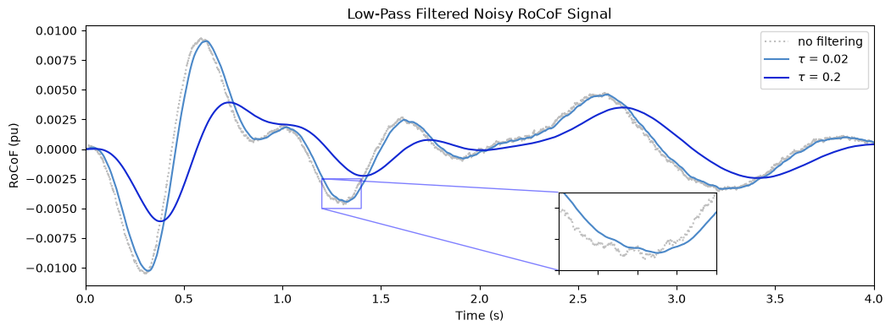
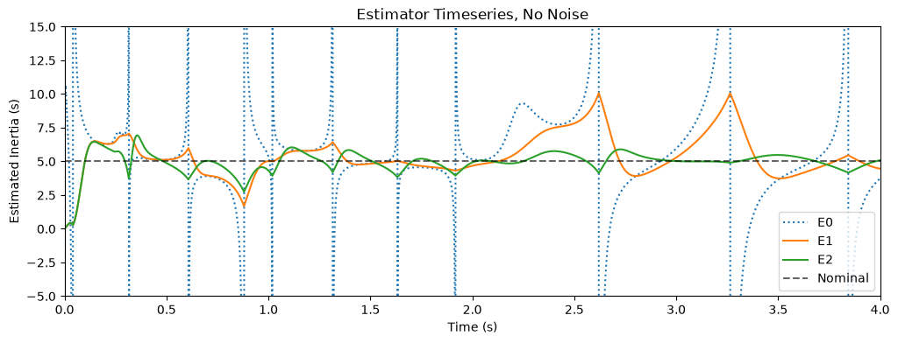
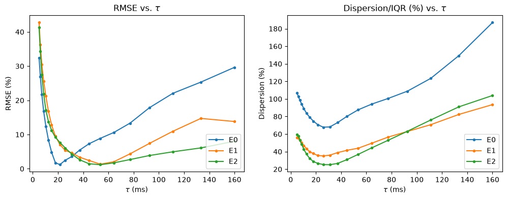

# Characterizing the Noise-Lag Tradeoff of Inertia Estimation: A Methodology Applied to Virtual Synchronous Generators
*Scarlett Chen (Edgemont Junior-Senior High School), Ziang Zhang (SUNY Binghamton)*

Code for all implementation, data analysis, and figures is included here for replicability.

**Abstract** — The decrease in power system inertia caused by the increased penetration of inverter-based resources (IBRs) necessitate better methods of inertia estimation, especially for resources that are able to deliver a fast frequency response (FFR) during a disturbance. Inertia estimation usually requires the use of the rate of change of frequency (RoCoF) measurement gathered by phasor measurement units, which comes with non-negligible noise that may be smoothed with a low-pass filter. However, a higher filter time constant additionally causes delay and possible signal distortions which can also affect the estimated inertia. Here, we establish a framework for characterizing this tradeoff and demonstrate it with several inertia estimation methods on a virtual synchronous generator simulation model. Noise is modeled as an Ornstein-Uhlenbeck stochastic process which is injected into RoCoF measurements. We calculate metrics such as the response time and RMSE across different filter time constants with varied visualizations. This provides a new angle to evaluating inertia estimation methods and underscores the importance of considering this tradeoff when implementing inertia estimation in the real world.

Paper in progress!

## Some Figures
Visualization of the noise-lag tradeoff on a RoCoF signal:

Recreation of Liu et al.'s E0, E1, and E2 estimators: 

Tradeoff Characterization Results:

Some more can be viewed in /out. 
